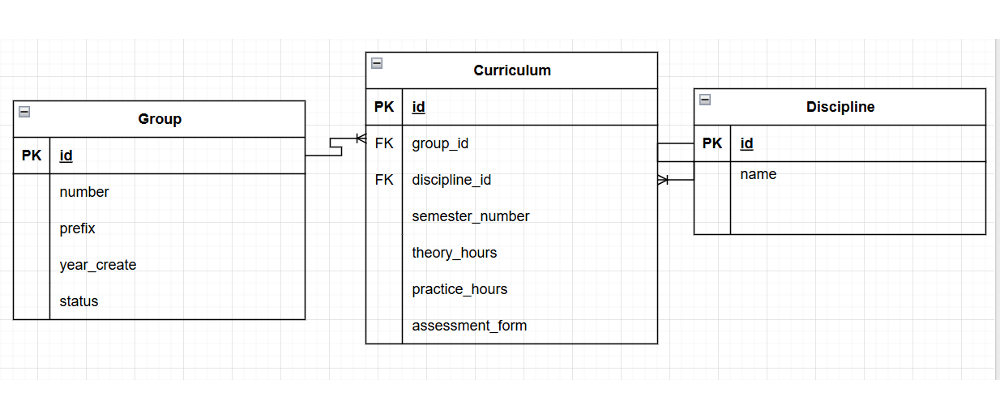

# Вариант №12. Сервис учебного плана

**Главный документ:** какие дисциплины, в каком семестре, сколько часов (теория / практика), форма отчетности (экзамен / зачет).

---

## Сущность: Curriculum (учебный план)

### Информация, требуемая для создания Curriculum

| Parameter | Required | Type | Constraint | Default |
|-----------|----------|------|-------------|---------|
| `discipline_id` | Yes | Integer | > 0 | |
| `group_id` | Yes | Integer | > 0 | |
| `semester_id` | Yes | Integer | > 0 (ссылка на Semester) | |
| `theory_hours` | Yes | Integer | ≥ 0 | |
| `practice_hours` | Yes | Integer | ≥ 0 | |
| `assessment_form` | Yes | Enum | `exam` / `credit` | |

**Unique constraint:**  
`(group_id, discipline_id, semester_id)` — одна дисциплина не может быть дважды у одной группы в одном семестре.

### Возвращаемые данные при успешном создании

| Parameter | Type |
|-----------|------|
| `id` | Integer |
| `discipline_id` | Integer |
| `group_id` | Integer |
| `semester_id` | Integer |
| `theory_hours` | Integer |
| `practice_hours` | Integer |
| `assessment_form` | Enum |
| `is_active` | Boolean |

---

## Изменение Curriculum по ID

**Допустимые для изменения поля:** `theory_hours`, `practice_hours`, `assessment_form`.  
**Поля, которые нельзя изменить:** `discipline_id`, `group_id`, `semester_id`, `is_active` (деактивация выполняется через отдельный метод `soft_delete`).

### Входные параметры

| Parameter | Required | Type | Constraint |
|-----------|----------|------|-------------|
| `id` | Yes | Integer | > 0 |
| `theory_hours` | No | Integer | ≥ 0 |
| `practice_hours` | No | Integer | ≥ 0 |
| `assessment_form` | No | Enum | `exam` / `credit` |

> **Примечание:** Поле `is_active` нельзя изменить через этот метод. Для деактивации используется отдельный метод `soft_delete`.

### Возвращаемые данные

| Parameter | Type |
|-----------|------|
| `id` | Integer |
| `discipline_id` | Integer |
| `group_id` | Integer |
| `semester_id` | Integer |
| `theory_hours` | Integer |
| `practice_hours` | Integer |
| `assessment_form` | Enum |
| `is_active` | Boolean |

---

## Удаление Curriculum по ID 

Выполняет **мягкое удаление** — запись не удаляется физически, а устанавливается `is_active = False`.

**Возвращаемое значение:**
- `True` — запись успешно деактивирована (была активна)
- `False` — запись уже была деактивирована или не найдена

> **Примечание:** Реактивация (`is_active = True`) не предусмотрена в рамках данного сервиса.

---

## Получение Curriculum по ID

### Возвращаемые данные

| Parameter | Type |
|-----------|------|
| `id` | Integer |
| `discipline_id` | Integer |
| `discipline_name` | String |
| `group_id` | Integer |
| `group_name` | String |
| `semester_number` | Integer |
| `semester_academic_year` | String |
| `theory_hours` | Integer |
| `practice_hours` | Integer |
| `assessment_form` | Enum |
| `is_active` | Boolean |

> **Примечание:** Поле `total_hours` не возвращается, так как является вычисляемым и не хранится в БД.

---

## Получение списка Curriculum с фильтрацией

### Входные параметры фильтрации

| Parameter | Type |
|-----------|------|
| `group_id` | Integer |
| `discipline_id` | Integer |
| `semester_number` | Integer |
| `assessment_form` | Enum |
| `theory_hours_min` | Integer |
| `theory_hours_max` | Integer |
| `practice_hours_min` | Integer |
| `practice_hours_max` | Integer |
| `is_active` | Boolean |
| `page` | Integer |
| `page_size` | Integer |

**Поведение по умолчанию:**
- Если параметр `is_active` не указан, возвращаются **только активные записи** (`is_active = true`)
- Пагинация: `page = 1`, `page_size = 20`

### Выходные данные (список)

| Parameter | Type |
|-----------|------|
| `id` | Integer |
| `discipline_id` | Integer |
| `discipline_name` | String |
| `group_id` | Integer |
| `group_name` | String |
| `semester_number` | Integer |
| `semester_academic_year` | String |
| `theory_hours` | Integer |
| `practice_hours` | Integer |
| `assessment_form` | Enum |
| `is_active` | Boolean |

> **Примечание:** Поле `total_hours` не возвращается, так как является вычисляемым.

---

## ER-диаграмма

