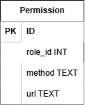

# Вариант №4. Сервис разрешений (Permission Service)

### Назначение сервиса
Сервис предоставляет возможность управления правами доступа для ролей пользователей. 
Каждое право определяет, какое действие (HTTP метод + URL) разрешено для конкретной роли.

---

## Добавить разрешение
|Метод| Ссылка              |
|---|---------------------|
|`POST`|`/permissions/{role_id}/`|

### Информация, требуемая для создания разрешения

| Параметр          | Пояснение | Обязательность | Тип | Ограничение                   | Значение по умолчанию |
|-------------------|-----------|----------------|-----|-------------------------------|----------------------|
| `role_id` (в URL) | ID роли   | Обязательно    | Целое число | от 1 до 6                     | |
| `method`          | Метод     | Обязательно    | Строка         | GET, POST, PATCH, DELETE и тд | |
| `url`             | Ссылка    |  Обязательно   | Строка         | Поддерживает шаблон `*`       | |

Символ `*` - используется в качестве подстановочного символа
для создания URL-паттерна. Он заменяет `ровно один` любой сегмент пути URL.

### Примеры
| request_url (запрашиваемый URL)	 | template_url (шаблон URL из таблицы) | 	Результат |
|--------------------------------------|------------------------------------------|---|
| /users/123                           | 	/users/*                                | 	True |
| /users/123/posts                     | 	/users/*                                | False |
| /admin/dashboard                     | /admin/dashboard                         | True |
| /admin                               | 	/admin/*                                |False |
| /api/v1/users                        | 	/api/*/users	                           | True |

### Информация, возвращаемая при успешном создании

| Параметр | Тип |
|----------|-----|
| `status_code` | Целое число (201) |
| `detail` | Строка |
| `permission_id` | Целое число |

---

## Изменить разрешение по ID
|Метод| Ссылка              |
|---|---------------------|
| `PATCH`  | `/permissions/{permission_id}/` |

### Входные параметры

| Параметр         | Пояснение | Обязательность  | Тип | Ограничение | Значение по умолчанию |
|------------------|-----------|-----------------|-----|-------------|-----------------------|
| `role_id` | ID роли   | Не обязательно  | Целое число    | От 1 до 6   | `None`                |
| `method`         | Метод     | Не обязательно  | Строка          |  GET, POST, PATCH, DELETE и тд            | `None`                |
| `url`            | Ссылка    |  Не обязательно | Строка         |             | `None`                |

### Информация, возвращаемая при успешном изменении

| Параметр | Тип |
|----------|-----|
| `status_code` | Целое число (200) |
| `detail` | Строка |
| `permission_id` | Целое число |

---

## Удалить разрешение по ID

### Входные параметры

| Параметр | Пояснение     | Обязательность | Тип | Ограничение | Значение по умолчанию |
|----------|---------------|----------------|-----|-------------|----------------------|
| `permission_id` (в URL) | ID привилегии |  Обязательно   | Целое число    | Больше 0    | |

### Информация, возвращаемая при успешном удалении

| Параметр | Тип |
|----------|-----|
| `status_code` | Целое число (200) |
| `detail` | Строка |
| `permission_id` | Целое число |

### Информация, возвращаемая при ошибке

| Параметр | Тип                        |
|----------|----------------------------|
| `status_code` | Целое число (404)          |
| `detail` | Строка (Запись не найдена) |

## Получить все разрешения
| Метод |     Ссылка      |
|-------|:---------------:|
| `GET` | `/permissions/` |

### Параметры которые принимает запрос 

| Параметр        | Пояснение                       | Обязательность | Тип         |
|-----------------|---------------------------------|---------------|-------------|
| `permission_id` | Идентификатор разрешения        | Необязательный            | Целое число |
| `role_id`       | Идентификатор роли              |          Необязательный     | Целое число |
| `limit`         | Количество записей в ответе     |        Необязательный       | Целое число |
| `offset`        | Сколько записей нужно отбросить |          Необязательный     | Целое число |

### Информация, возвращаемая при успешном поиске

#### С параметром `permission_id`

Возвращается словарь со следующей структурой

| Параметр        | Тип         |
|-----------------|-------------|
| `permission_id` | Целое число |
| `role_id`       | Целое число |
| `method`        | Строка      |
| `url`           | Строка      |

#### С параметром `role_id`
Возвращается список словарей со следующей структурой 

| Параметр | Тип |
|----------|-----|
| `permission_id` | Целое число |
| `method` | Строка |
| `url` | Строка |

#### С параметром `limit`

| Параметр | Тип |
|----------|-----|
| `role_id` | Список объектов разрешений для данной роли |

**`Примечание`**: Будет возвращено `limit` записей 

#### С параметром `offset`

| Параметр | Тип |
|----------|-----|
| `role_id` | Список объектов разрешений для данной роли |

**`Примечание`**: Будет пропущено `offset` записей 

#### Без параметров
Будет возвращен объект со всеми ролями и их ограничениями 

| Параметр | Тип |
|----------|-----|
| `role_id` | Список объектов разрешений для данной роли |

## ER-диаграмма

# Функция check_url
### Назначение
Выполняет сравнение реального URL запроса с паттерном URL разрешения. 
Поддерживает подстановочный символ `*`, который заменяет любой сегмент пути

### Входные параметры
    
| Параметр | Обязательность | Тип | Описание                            |
|----------|----------------|-----|-------------------------------------|
|request_url|	Обязательно	|Строка	| Реальный URL из HTTP запроса        |
|template_url|	Обязательно	|Строка	| URL паттерн из БД | 

### Возвращаемое значение
|Тип| Условие	 | Описание                      |
|---|-------|-------------------------------|
|bool|True| URL соответствует паттерну    |
|bool|False| URL не соответствует паттерну |

## Алгоритм работы
|Шаг| 	Действие                                                |
|----|----------------------------------------------------------|
|1| Удалить символы `/` в начале и конце обоих URL           |
|2| Разделить строки на сегменты по символу `/`              |
|3| Если количество сегментов не совпадает → вернуть `False` |
|4| Попарно сравнить сегменты                                |
|5| Если сегмент паттерна = `*` → пропустить проверку        |
|6| Если сегменты не равны → вернуть `False`                 |
|7| Все сегменты совпали → вернуть `True`                    |

# Функция `check_permission`

### Назначение
Проверяет, разрешено ли выполнение указанного HTTP метода и URL для заданной роли. 
Поиск ведётся по точному совпадению метода и соответствию URL паттерна.

### Входные параметры

| Параметр | Обязательность | Тип | Ограничение                        | Описание |
|----------|----------------|-----|------------------------------------|----------|
| `role_id` | Обязательно | Целое число | от 1 до 6                          | Идентификатор роли |
| `method` | Обязательно | Строка | GET, POST, PATCH, PUT, DELETE и тд | HTTP метод запроса |
| `url` | Обязательно | Строка |                                    | URL запроса |

### Возвращаемое значение

#### Успешный ответ (разрешение найдено)

| Параметр | Тип | Значение |
|----------|-----|----------|
| `status_code` | Целое число | `200` |
| `allowed` | Логический | `True` |

#### Ошибочный ответ (разрешение не найдено)

| Параметр | Тип | Значение |
|----------|-----|----------|
| `status_code` | Целое число | `403` |
| `allowed` | Логический | `False` |
| `reason` | Строка | `Действие {method} {url} не разрешено` |

### Алгоритм работы

| Шаг | Действие                                                    |
|-----|-------------------------------------------------------------|
| 1 | Сформировать строку действия: `"{method} {url}"`            |
| 2 | Получить из БД все разрешения для указанной `role_id` и `method` |
| 3 | Для каждого разрешения вызвать `check_url(url, permission.url)` |
| 4 | Если совпадение найдено → вернуть `{200, True}`             |
| 5 | Если совпадений нет → вернуть `{403, False, reason}`        |

### Примечания

- Поиск выполняется только по точному совпадению HTTP метода
- URL проверяется по паттерну `*`

# Функция require_permission

### Назначение
Dependency FastAPI для проверки прав доступа. Вызывается перед обработкой эндпоинтов.

### Параметры
| Параметр | Тип | Описание |
|----------|-----|----------|
| `request` | `Request` | Объект HTTP запроса FastAPI |

### Возвращаемое значение
| Тип | Описание |
|-----|----------|
| `dict[str, bool]` | Словарь с результатом проверки (без поля `status_code`) |

### Исключения
| Тип | Код | Условие |
|-----|-----|---------|
| `HTTPException` | 403 | Действие не разрешено для роли пользователя |

### Логика работы
1. Извлекает из запроса HTTP метод и URL
2. Вызывает `check_permission()` с role_id (который в свою очередь получается из заголовка)
3. При успехе (status_code=200) возвращает результат
4. При ошибке (status_code=403) возвращает HTTP 403

## UX приложения (Desktop на Tkinter)

### Функционал интерфейса

| Элемент           | Действие |
|-------------------|----------|
| Кнопка "Добавить" | Открывает форму для создания нового разрешения |
| Таблица           | Отображает все разрешения: ID, Роль, Метод, Ссылка |
| ЛКМ по строке     | Открывает форму редактирования выбранного разрешения |
| ПКМ по строке     | Удаляет выбранное разрешение (с подтверждением) |

### Форма добавления/редактирования

- **Роль:** Выпадающий список (1-6)
- **Метод:** Выпадающий список (GET, POST, PACTH, PUT, DELETE)
- **Ссылка:** Текстовое поле для ввода URL
- **Кнопка "Сохранить"** — сохраняет изменения в БД

---

